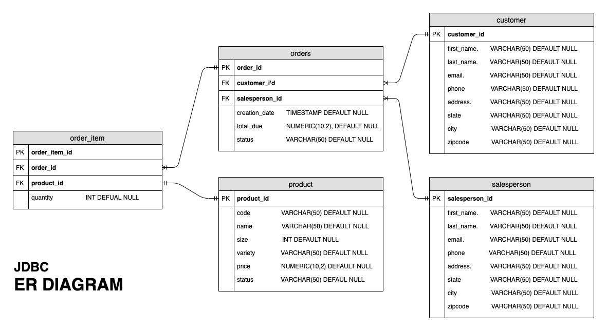

# Introduction
The JDBC project explores the Java API to connect a Java application to an RDBMS through the java SQL library.

The program also provides different sample codes to demonstrate CRUD operations to a DB instance using PSQL.

The program implements the DAO pattern to manage the connection with the data source to obtain and store data and
utilizes the Repository Design pattern to manage the business objects.

# Implementation
## ER Diagram

## Design Patterns
DAO - Data Access Object is a pattern that provides an abstract interface to a database
where it enables data operations without exposing the details of the database.

The Repository pattern provides an abstraction to the data store and enables replacement
of the data store without changing the business logic.

The main difference between the two:
1. DAO is an abstraction of data persistence while a repository is an abstraction of a collection of objects.
2. DAO works as a data mapping/access layer, hiding ugly queries while a repository is a layer between domains and data access layers, hiding the complexity of collating data and preparing a domain object

# Test
The program utilized the sample database illustrated above in the ER Diagram using a PSQL instance for testing.

The sample codes for CRUD operation in the main method were run separately against these data.  
The individual results were then compared to the results from DBeaver, a GUI to run DB queries.
