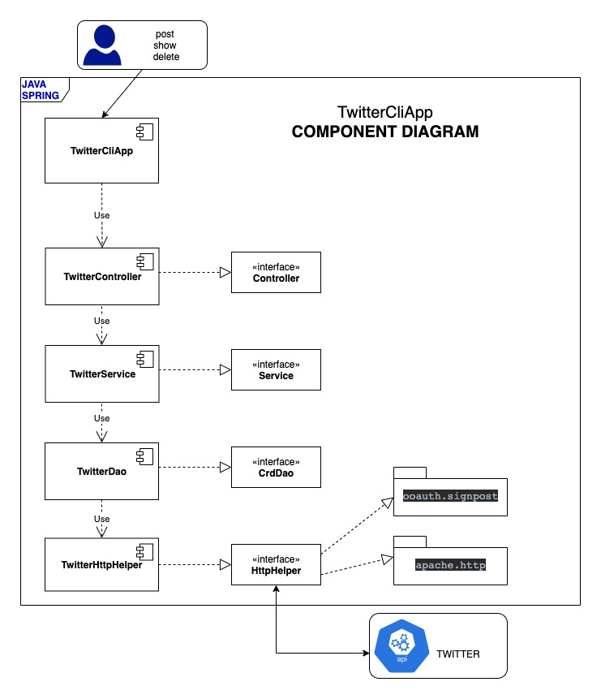

# Introduction
The Twitter CLI provides an interface to interact with Twitter.

The app lets the user post a tweet, view a tweet from a specific user with a given ID
and delete tweets given a list of IDs.

The app follows the MVC architecture and utilizes the Twitter RESTful API using
the Apache HTTPComponents library to connect to Twitter.

The project is developed using the Spring Framework and utilizes the Spring Bootstrap module to build the app with minimal configuration.

Testing was carried out using Mockito and JUnit, packaged via Maven, and deployed as a Docker image.

# Quick Start
- Packaging  via Maven
  ```
   $ mvn clean package
   ```
- Deployment via Docker
  ```
  Usage:
  TwitterApp post|show|delete [options]
  
  $ docker pull jjfalcon/twitter
  $ docker run --rm \
  -e consumerKey = YOUR_VALUE \
  -e consumerSecret = YOUR_VALUE \
  -e accessToken = YOUR_VALUE \
  -e tokenSecret = YOUR_VALUE \
  jjfalcon/twitter "USAGE"
  
  ```

# Design
## UML diagram

## The Components
TwitterCliApp
- The view in MVC responsible for collecting the CLI arguments, 
  calling the appropriate functions then 
  returning the VIEW of the corresponding results in pretty JSON.

TwitterController
- The controller in MVC responsible for controlling the flow of the program and acts as an interface between the View and Model components.
  It calls Service Component based on user input and option
  to retrieve the corresponding business logic, acquire the results, and pass it to the VIEW for rendering. 

TwitterService
- The business logic of the app responsible for determining how data is created, altered, showed, or stored using the MODEL objects.
  It also provides a set of rules to validate objects and how each interacts with the other.
  With this particular app, it is responsible for validating the tweet's text message and coordinates.

TwitterDao
- Related to model in MVC, it is responsible for all data-related logic such as 
  how data is being transferred between the View and Controller components.
  More importantly, it is responsible for modeling the data 
  by utilizing the actual Model objects, to and from Twitter and
  utilizes the HttpHelper for its transport.

TwitterHttpHelper
- As the name suggests, it handles the HTTP communication using the "apache.http" library between the app and the Twitter API.
  It is also responsible for authorization using the "oauth" library and for the actual transport [sending and receiving] of data. 
  

## Models
This app uses a simplified version of the Tweet Model as follows:
- Tweet Model
- Entity Model
- HashTag Model
- UserMention Model
- Coordinates

The Objects are modelled following this sample JSON output.
 ```
{
   "created_at":"Mon Feb 18 21:24:39 +0000 2019",
   "id":1097607853932564480,
   "id_str":"1097607853932564480",
   "text":"test with loc223",
   "entities":{
      "hashtags":[
         {
            "text":"documentation",
            "indices":[
               211,
               225
            ]
         },
         {
            "text":"parsingJSON",
            "indices":[
               226,
               238
            ]
         },
         {
            "text":"GeoTagged",
            "indices":[
               239,
               249
            ]
         }
      ],
      "user_mentions":[
         {
            "name":"Twitter API",
            "indices":[
               4,
               15
            ],
            "screen_name":"twitterapi",
            "id":6253282,
            "id_str":"6253282"
         }
      ]
   },
   "coordinates":{
      "coordinates":[
         -75.14310264,
         40.05701649
      ],
      "type":"Point"
   },
   "retweet_count":0,
   "favorite_count":0,
   "favorited":false,
   "retweeted":false
}
```
## Spring
The app is implemented using the Spring framework to enable a decoupling between components in the app.

It utilizes the Spring IoC container to remove the dependency relationships between the components, 
by injecting the dependencies via the @ComponentScan approach.

This approach takes advantage of the implementation of interfaces by passing the dependencies
through the constructor using the @Autowired annotation.


# Test
The development implemented both Unit and Integration testing.

Mockito facilitated unit testing by creating and configuring Mock objects 
for classes with external dependencies that are being tested.

JUnit facilitated integration testing to ensure that all components 
functioned together as expected.

# Improvements
- Retrieve by hashtags
- Retrieve only favorited tweets
- Retrieve tweets containing keywords
