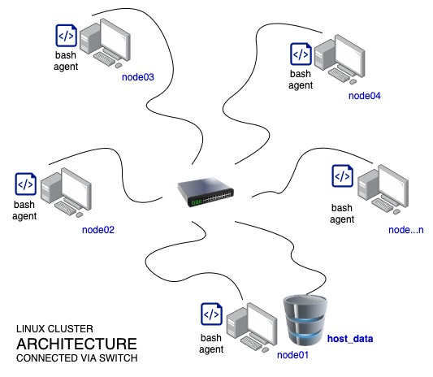
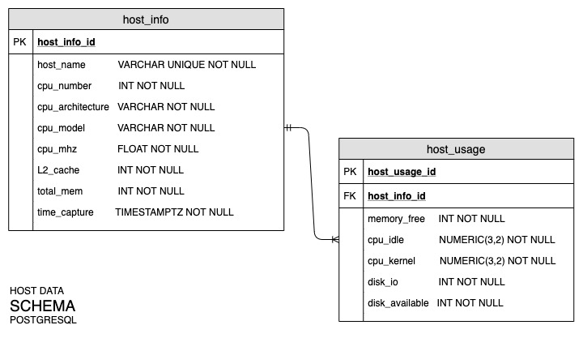

# Linux Cluster Monitoring Agent

The Linux Cluster Monitoring Agent [LCMA] is a set of tools user can use to gather the hardware information
and monitor the resource usage of nodes connected to a Linux Cluster.

It includes two bash scripts to run:

```bash
./scripts/host_info.sh
./scripts/host_usage.sh
```

The host_info.sh script gathers hardware information such as the CPU number,
CPU architecture, CPU transmission speed [in MHz], and Memory capacity.

The host_usage.sh script provides a snapshot of the node's CPU idle time
and memory consumptions in real-time.

The agent will run at each node to collect data. These collected data will be automatically
sent and stored in Relational Database Management Systems using PostgreSQL, which can be later
queried to provide reports to help with resource planning.

## Network Architecture

The Linux cluster of nodes is connected internally via a switch and communicates
through internal IPv4 addresses.  It runs on CentOS 7 distro.

Below is the illustration of the Network Architecture.



## Database Schema

PostgreSQL and consist of 2 tables to store the node's
hardware specifications which are assumed to be static, and resource usage, which will
be captured in real-time every minute.

Below is the illustration of the Database Schema.



## Script Descriptions
* host_info.sh
    * A bash script that collects the node's hardware specifications.
    * The collected data is assumed to be static and inserted to the psql instance.


* host_usage.sh
  * A bash script that collects the node's usage data.
  * The scripts will collect real-time data every minute using [crontab](https://phoenixnap.com/kb/set-up-cron-job-linux).
  

* psql_docker.sh
  * A bash script to start the docker daemon.
  * It provides an option to create, start or stop a docker container.


* ddl.sql
  * A psql CLI to create the two host data tables.


* queries.sql
  * These are sample queries to generate reports for use in resource planning.

## Implementation
1. Database and Table Initialization
    *  Provision a psql instance by creating a psql docker container, and once started, initialize the database and tables.
       
*To create a psql docker container with the given username and password:*
```bash
./scripts/psql_docker.sh create db_username db_password
```
*To initialize the database instance:*
```bash
psql -h host_name -U user_name -d database_name -f sql/ddl.sql
```

2. Node Hardware Specification Data Collection
  *  Run once to collect and insert the node's hardware information into the psql instance.
     
*To collect hardware specification data:*
```bash
./scripts/host_info.sh psql_host psql_port db_name psql_user psql_password
```

3. Node Resource Usage Data Collection
  *  This can be run manually or scheduled automatically through crontab.
     
*To run manually and collect hardware resource usage:*
```bash
./scripts/host_usage.sh psql_host psql_port db_name psql_user psql_password
```
*To set up crontab and run the script on scheduled timing:*
```bash
#edit crontab jobs
bash> crontab -e

#add this to crontab
* * * * * bash /home/centos/dev/jrvs/bootcamp/linux_sql/host_agent/scripts/host_usage.sh localhost 5432 host_agent postgres password > /tmp/host_usage.log

#list crontab jobs
crontab -l

#validate your result from the psql instance
cat /tmp/host_usage.log

```

## Improvements
1. Add a script to detect and update hardware specification changes.
2. Add a script [sql queries] to generate standard daily reports. 

