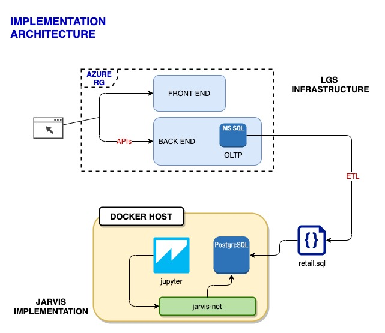

# Introduction
LGS, London Gift Shop is a UK-based online store that sells gift-ware
whose revenue has plateaued for the past 10 years.

They are looking to increase revenue through data-driven marketing strategies
by utilizing the latest technology to gain a better view into
their customers’ motivations, preferences, and behaviors.

This project is a POC development to provide LGS business intelligence
about their sales trend and customer portfolio.

RFM segmentation will also be provided to allow LGS
to target a specific group of customers with marketing efforts that
are highly relevant for their particular behaviour.

# Implementation
This application is implemented in python within the Jupyter Notebook environment
and will utilize the Pandas Dataframe and Matplotlib to provide the relevant business intelligence and charts.

### Project Architecture
LGS currently uses Microsoft Azure Resource Group to house their full-stack application
and uses Azure SQL Server [OLTP] as the DB for day-to-day business.

As a POC we are only provided with a data dump for transactions
between 01/12/2009 and 09/12/2011 to work on.

This retail.sql file is saved [here](./psql/retail.sql).

This application ran on the Jupyter Notebook environment that accesses   
the file ingested into a PostgreSQL DB via Docker containers.

A docker bridge network connects the two containers.

### Architecture Diagram

## Data Analytics and Wrangling
### Data Analytics
The Data Analysis in Jupyter Notebook (found [here](./retail_data_analytics_wrangling.ipynb)) performs data preparation and cleansing, and then presents the following analytics and charts:
1. Monthly Distribution of Regular Orders vs Cancelled Orders
2. Monthly Sales and its Growth Trends
3. Monthly Distribution of Existing vs New Customers
4. RFM Segmentation Analysis

### Business Intelligence
#### Based on Monthly Distribution of Existing vs New Customers
+ While there is a consistent amount of "New Customers" added every month, there is no corresponding growth in "Existing Customer.
    
+ The fluctuation [increase/decrease] in "Existing Customers" suggests that there is a significant amount of customers "abandoning" the company.

Recommendation:  
Investigate whether customers are being deleted from the DB.  
This should not happen, instead inactive customers should be marked down as inactive.
Then, analyze inactive customers and perform a correlation analysis against products purchased.

#### Based on RFM Segmentation
+ Marketing Strategy 01:  Target Segments:  About to Sleep, At Risk, Hibernating, Need Attention
+ Marketing Strategy 02:  Target Segments:  Can't Lose, Champions, Loyal Customers
+ Marketing Strategy 03:  Target Segments:  New Customers, Possible Loyalists, Promising

Recommendation:
- Marketing Strategy 01:  These are segments who are likely unsatisfied with existing products.
    
  Reach out and provide incentives in getting feedback on products purchased.
   
  Introduce any new products and/or product improvements that might get them interested again.
   
  Introduce free trial periods on new products.
   

- Marketing Strategy 02:  These are segments who are likely very satisfied with existing products.
    
  Regularly reach out and provide incentives in being "great" customers.  
  Constant communication is key to ensure they feel valued.
   
  Introduce occasional discount promotions as a way to say Thank You.
   
  Introduce loyalty recognition promotions.

- Marketing Strategy 03:  These are segments who are likely exploring existing products.
    
  Introduce cross-promotions. ie) Introduce additional products related to their first purchase.
   
  Introduce loyalty programs and provide incentives to sign up.
   
  Introduce awareness campaigns to get them educated of existing products / product lines.

# Improvements
- Provide Analyses on Customer Churn [based on a certain period of inactivity]
- Provide Analyses on Product Segments
- Provide Correlation Analyses between Products vs Months/Season and/or Customer Demographics

