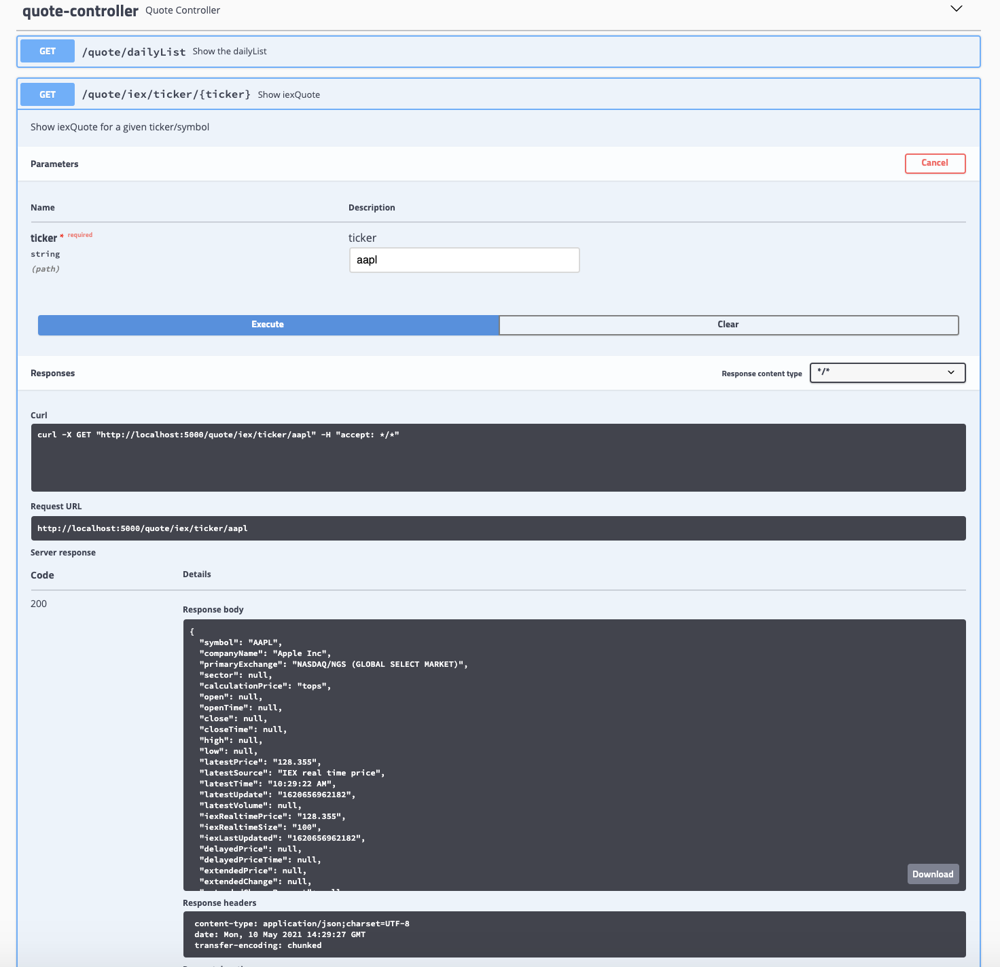
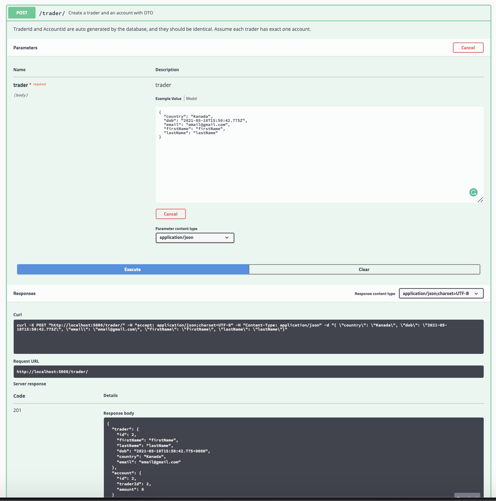
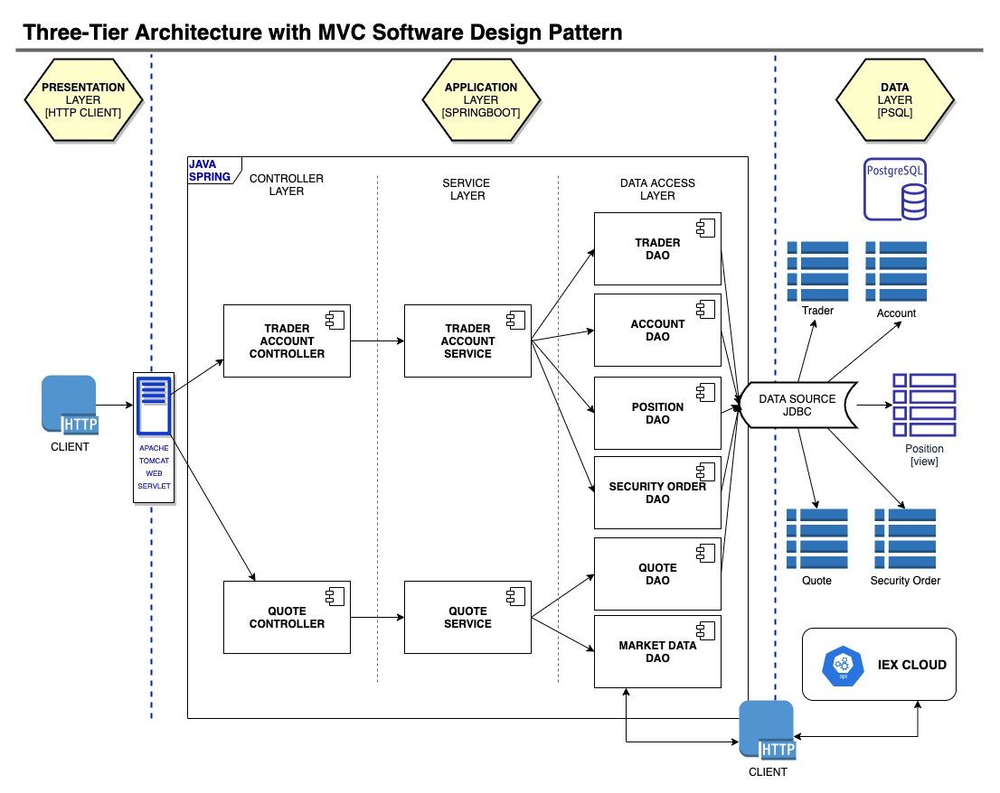
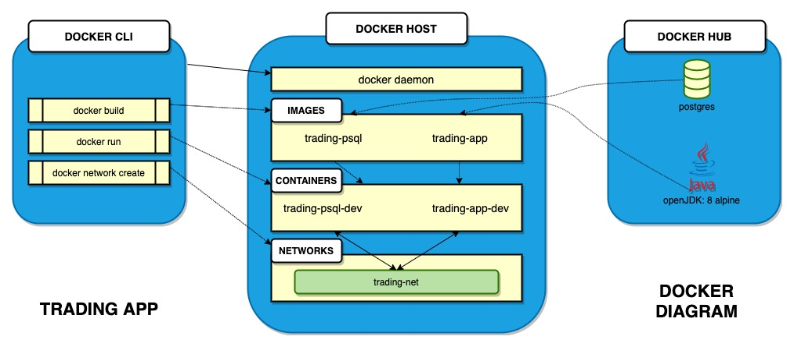

# Introduction
This project is a POC development of a new trading platform MVP to replace a legacy system built as
a monolithic application with a system built following the microservice architecture.

This project is a REST API that allows users to manage client profiles and accounts,
monitor portfolio performance and trade securities.

The microservices are auto-configured using SpringBoot and utilize Apache Tomcat as the embedded servlet.

The app is built within a Spring Framework to facilitate a decoupling via IoC.

The app fetches data from IEX Cloud via its REST API and persisted to a PostgreSQL database.

# Quick Start
## Prerequisites: 
- Docker v17.05 or higher
- How to start the application:

  - Step 1: Create a Docker network to connect the PSQL and Trading App container  

    ```
    $ docker network create trading-net
    ```
  - Step 2: Build Docker images for PSQL and the Trading App

    ```
    # Building PostgreSQL Image
    $ cd ./springboot/psql
    $ docker build -t trading-psql .
      
    # Building Springboot Trading Application Image
    $ cd ./springboot
    $ docker build -t trading-app .
    ```
    
  - Step 3: Start the PSQL container with connection to the trading-net network

    ```
    $ docker run --name trading-psql-dev \
    -e POSTGRES_PASSWORD=password \
    -e POSTGRES_DB=jrvstrading \
    -e POSTGRES_USER=postgres \
    --network trading-net \
    -d -p 5432:5432 trading-psql
    ```
  - Step 4: Set up `IEX_PUB_TOKEN` environment variable for IEX API access, and start the Trading App container with connection to the trading-net network

    ```
    # Set credential obtained from IEX
    $ IEX_PUB_TOKEN="YOUR TOKEN"
      
    # Start the container
    $ docker run --name trading-app-dev \
    -e "PSQL_URL=jdbc:postgresql://trading-psql-dev:5432/jrvstrading" \
    -e "PSQL_USER=postgres" \
    -e "PSQL_PASSWORD=password" \
    -e "IEX_PUB_TOKEN=${IEX_PUB_TOKEN}" \
    --network trading-net \
    -p 5000:8080 -t trading-app
    ```

After starting both Docker containers, test the app using Swagger in your browser by connecting to `http://localhost:8080/swagger-ui.html`




# Implementation
## Architecture
This application was designed with a Three-Tier Architecture with the
following primary layers: the Presentation layer, the Application layer, and the
Data layer. 

The Application layer was designed following the MVC Software Design Pattern with the
following layers: the Swagger as the VIEW; the Controller layer and the Service layer serves the CONTROLLER , and the DAO layer providing access to the MODELS.



- Controller Layer
  - This layer provides the web API endpoints. 
    It then parses the user input and calls the appropriate service functions 
    from the Service layer to process those inputs and present the results.
    
- Service layer
  - This layer provides the business logic to the Controller layer. 
    It handles data validation and processing of inputs received and 
    acquire data from the DB through the DAO layer.
    
- DAO Layer
  - This layer deals with the app's data sources by retrieving data from IEX's via an API, 
    then performs CRUD operations to the local database. 
    
- SpringBoot
  - Provides the framework and toolkit to manage class dependencies and auto-configurations.
    It also supplies an Apache Tomcat WebServlet to handle API requests.
    
- Data Layer:  PSQL and IEX 
  - The data stores used by the app.
  - PSQL is the backend RDBMS for this application.
  - IEX is an open-source API that supplies all real-time stock data for this application.

## REST API Usage
### Swagger
Swagger allows you to describe the structure of your APIs so that machines can read them. 

Swagger is used to provide users easy to read and inter-active API documentation. 

### Quote Controller
- Enables the creation, displaying and updating of quote data to the local RDBMS from IEX.
  - `GET /quote/iex/ticker/{symbol}`
    - Updates quote table using iex data
  - `PUT /quote/iexmarketdata`
    - Updates quote table using iex data
  - `PUT /`
    - Updates a given quote in the quote table
  - `POST /tickerId/{tickerId}`
    - Adds a new ticker to the dailyList (quote table)
  - `GET /quote/dailylist`
    - Displays all securities that are available for trading

### Trader Account Controller
- Enables the CRUD operations of users and their accounts.
  - `POST /create?firstname=...&lastname=...&email=...&country=...&birthdate=...`
    - Creates a trader, and an account
  - `POST /`
    - Creates a trader and an account with DTO
  - `DELETE /traderId/{traderId}`
    - Deletes a trader corresponding to the id
  - `PUT /deposit/traderId/{traderId}/amount/{amount}`
    - Deposit funds to the account that associates with the given traderId
  - `PUT /withdraw/traderId/{traderId}/amount/{amount}`
    - Withdraw funds to the account that associates with the given traderI
  
# Test
JUnit facilitated integration testing with code coverage to ensure that all components functioned together as expected.
Endpoints were tested using Swagger UI.

# Docker Deployment
Deployment is as illustrated in below diagram:



Image Descriptions:
- The trading-psql was built by pulling the Postgres image from DockerHub and is used to create the corresponding PSQL container/instance. 
  
  The Docker file contains the instructions
  
  `COPY *.sql /docker-entrypoint-initdb.d/`  

  which copies the DB schema script to create the table 
  and is automatically run when the database is first created.


- The trading-app was by pulling the openjdk:8-alpine for the Web API and is used to create the corresponding Trading App container/instance.

  The Docker file contains the instructions 
  
  `COPY --from=build /build/target/trading-1.0-SNAPSHOT.jar /usr/local/app/trading/lib/trading_app.jar`

  which copies the completed .jar file into our new image with the appropriate JDK and below command is to set the image's entrypoint to run it.

  `ENTRYPOINT ["java","-jar","/usr/local/app/trading/lib/trading_app.jar"]`
  

# Improvements
- Automatic scheduled updates of quote data on the quote table from IEX
- Multiple accounts per one trader
- Expand order types to include other orders [Limit/Stop-Loss/Stop-Limit/etc...]
